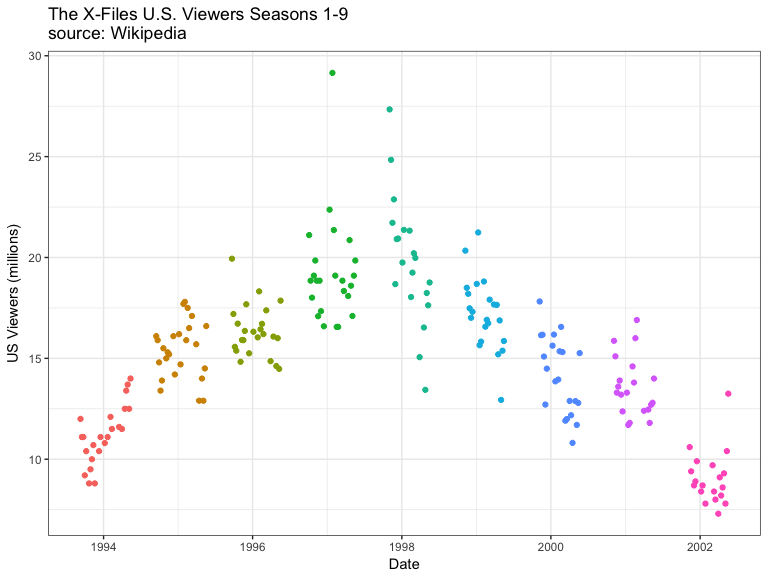

The Decline of the X-Files
================
Neil Saunders
2018-03-15

## Introduction

In this document, we use the *rvest* package to scrape viewing figures
for *The X-Files* from Wikipedia.

## Code

Using *rvest* and pipes, it’s quick and easy to extract a list of tables
from [the episode list
page](%22https://en.wikipedia.org/wiki/List_of_The_X-Files_episodes%22).
We then need to do a little extra work to create and format a data
frame, format dates and viewing figures, and add the season numbers.

``` r
library(rvest)
library(plyr)
library(stringr)
library(ggplot2)

wp <- "https://en.wikipedia.org/wiki/List_of_The_X-Files_episodes"
# the table numbers that contain the seasons 1-10
tables <- read_html(wp) %>% html_nodes("table") %>% .[c(2, 3, 4, 5, 6, 8, 9, 
    10, 11, 13)] %>% html_table()
x <- ldply(tables, function(x) as.data.frame(x, stringsAsFactors = FALSE))
# extraneous columns created; keep 1-8
x <- x[, 1:8]
# format viewing figures
x[, 8] <- as.numeric(gsub("\\[\\d+\\]", "", x[, 8]))
# format dates
x$date <- str_match(x$`Original air date`, "\\d{4}-\\d{2}-\\d{2}")
x$date <- as.Date(x$date, "%Y-%m-%d")
# add the seasons
x$season <- c(rep(1, 24), rep(2, 25), rep(3, 24), rep(4, 24), rep(5, 20), rep(6, 
    22), rep(7, 22), rep(8, 21), rep(9, 19), rep(10, 6))
```

## Visualization

We plot the raw viewing figures versus date. The viewing figures could
be corrected: for example, the U.S. population increased by around 10%
over the course of seasons 1-9. However, since we don’t know about
changes in television ownership or cable subscriptions in that time
period, we’ll just go with raw numbers for now. We’ll also restrict the
plot to the original 9
seasons.

``` r
ggplot(subset(x, season < 10), aes(date, `U.S. viewers\n(millions)`)) + geom_point(aes(color = factor(season))) + 
    theme_bw() + theme(legend.position = "none") + labs(x = "Date", y = "US Viewers (millions)", 
    title = "The X-Files U.S. Viewers Seasons 1-9\nsource: Wikipedia")
```

<!-- -->

### Notes

  - The most-watched episode (“Leonard Betts”, season 4), followed the
    Super Bowl broadcast
  - Season 5 also debuted strongly, but the audience quickly dropped off
  - The long-term decline in viewing figures began around midway through
    season 5
  - “The Rain King” (season 5) was the last episode to exceed 20 million
    viewers
  - Audience for “The Truth” (last episode, season 9) fell below the
    median for seasons 1-9, indicating that interest was well and truly
    absent by this stage

## Conclusion

I loved the X-Files, but it went about 3 seasons too long.
